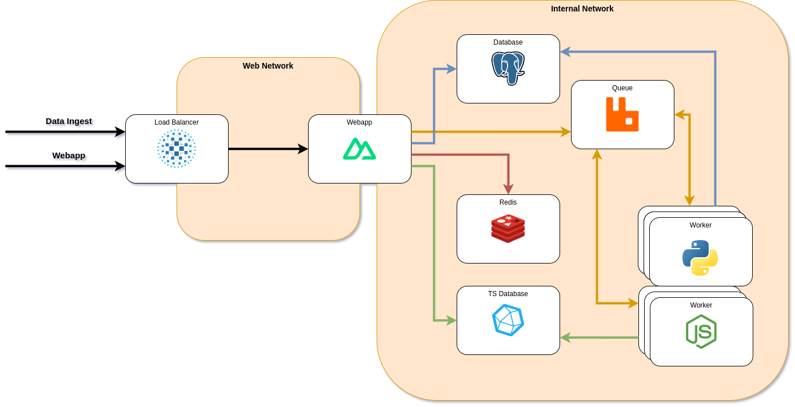

# BeeMLOps System

> Monorepo
>
> WS2023/24

## Infrastructure



## Setup

Please use Jetbrains WebStorm.

### Dev environment

First copy the example `.env` file and change the settings to your liking:

```shell
cp .env.example .env
cp db/.env.example db/.env
```

Now start the necessary services using `docker-compose -f docker-compose.yml -f docker-compose.dev.yml up -d`.

Wait for a few seconds and then migrate the database:

```shell
npm run install-all
cd db
npm run migrate
```

Now you can start the web dev server:

```shell
cd web
npm run dev
```

### NVM

To use the same node version, the [Node Version Manager](https://github.com/nvm-sh/nvm). Please install it and install
the specified node version using `nvm install` in the root directory.

Webstorm can use the correct version, if `.nvmrc` is selected:


### Prettier

This Repo uses Prettier for consistent code styling. WebStorm can automatically format your code on save. In the
Settingsdialog (File > Settings...) search for `prettier` and enable `Automatic Prettier configuration` for the these
files: `{**/*,*}.{js,ts,jsx,tsx,html,css,json,md,vue,astro}`. After that enable `Run on save`.


## Components

- [DB](./db)
  - ORM based on [Prisma.js](https://www.prisma.io/)
  - Represents the "Meta"-DB, without the time-series data
- [Webapp](./web)
  - Nuxt Webapp (based on Vue.js)
  - SSR
  - i18n
  - Server API
  - Auth (using sealed cookies)
- [Queue Worker](./queue)
  - Demo for RabbitMQ Queue
  - Simple Send-Receive
  - Simple RPC (Request + Response)
- Docker Stack
  - Additive compose files
    - [base](./docker-compose.yml)
      - Postgres database
      - Influx time-series database
      - RabbitMQ Queue
      - [Queue Worker](./queue)
      - Redis Storage
    - [prod](./docker-compose.prod.yml)
      - [Webapp](./web)
      - Loadbalancer with SSL
        - for now static certs, but supports certbot
    - [dev](docker-compose.dev.yml)
      - Exposes management ports
